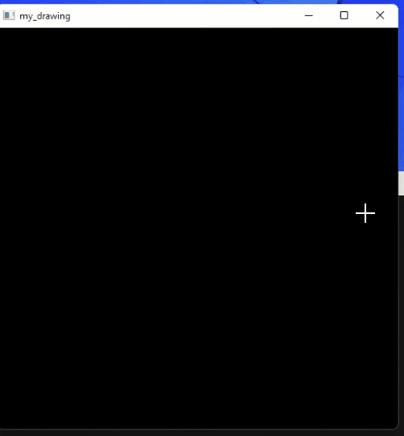

# Image Basics with OpenCV
In this section we will begin building an understanding of how to use the OpenCV library. Specifically how to open images and draw on them.

## Introduction:
* OpenCV (Open Source Computer Vision) is a library of programming functions mainly aimed at real-time computer vision.
* Created by Intel in 1999, it is written in C++ (we will be using the Python bindings)
* It contains many popular algorithms for computer vision, including object detection and tracking algorithms built-in.

**Section Goals:**
* Be able to open image files with OpenCV in both a notebook and a python script.
  * View notebooks: [0_Opening_Image_Files_in_a_Notebook.ipynb](./0_Opening_Image_Files_in_a_Notebook.ipynb), [1_Opening_Images_with_OpenCV.ipynb](./1_Opening_Images_with_OpenCV.ipynb)
  * For the script version refer to the section [below](#opening-image-files).
* Draw simple geometries on images.
  * View notebook: [2_Drawing_on_Images.ipynb](./2_Drawing_on_Images.ipynb)
* Directly interact with an image through callbacks.
  * View notebook: [3_Direct_Drawing_with_Mouse.ipynb](./3_Direct_Drawing_with_Mouse.ipynb)
  * For the script version refer to the section [below](#direct-drawing-with-mouse---part-1).

## Opening Image Files 
Run the following script to open `00-puppy.jpg` from our [DATA](../DATA) folder.

```
python mypuppy.py
```


## Direct Drawing with Mouse - Part 1
Run the following script to draw green circles on a black image. 

```
python connecting_a_function_for_drawing.py
```

- To draw green circles, press the left mouse button.




## Direct Drawing with Mouse - Part 2
Run the following script to draw green and blue circles on a black image. 

```
python adding_functionality_with_event_choices.py
```

- To draw green circles, press the left mouse button.
- To draw blue circles, press the right mouse button.


## Direct Drawing with Mouse - Part 3
Run the following script to drag and draw green rectangles on a black image. 

```
python dragging_with_mouse.py
```

- To draw a green rectangle, press the left mouse button, drag to a desired point, then release.


## Image Basics Assessment
My solution for the image basics assessment can be found here: [4_Image_Basics_Assessment.ipynb](./4_Image_Basics_Assessment.ipynb)


One of the tasks for the image basics assessment was to create a script that opens the `dog_backpack.jpg` from our [DATA](../DATA) folder and draw empty red circles whenever the right mouse button is clicked.

Run the following script to draw empty red circles on `dog_backpack.jpg`. 

```
python drawing_empty_red_circle_assessment.py
```

- To draw empty red circles, press the right mouse button.


 
